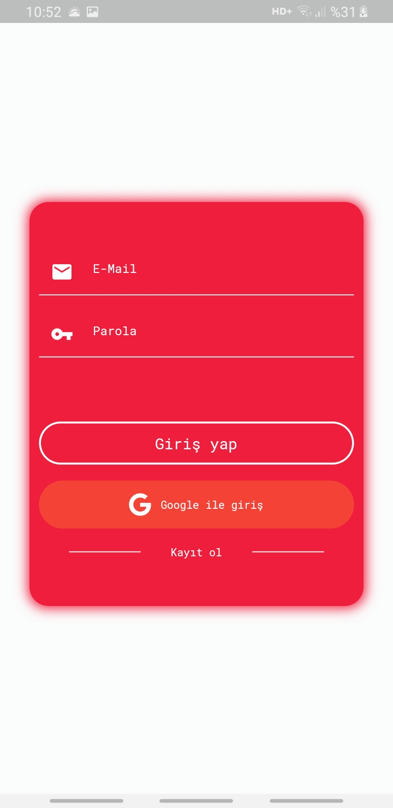
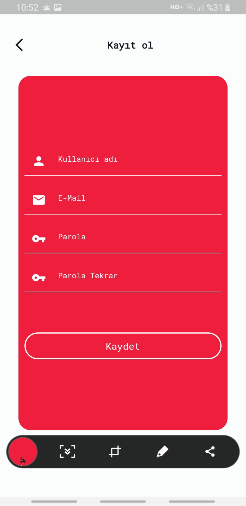
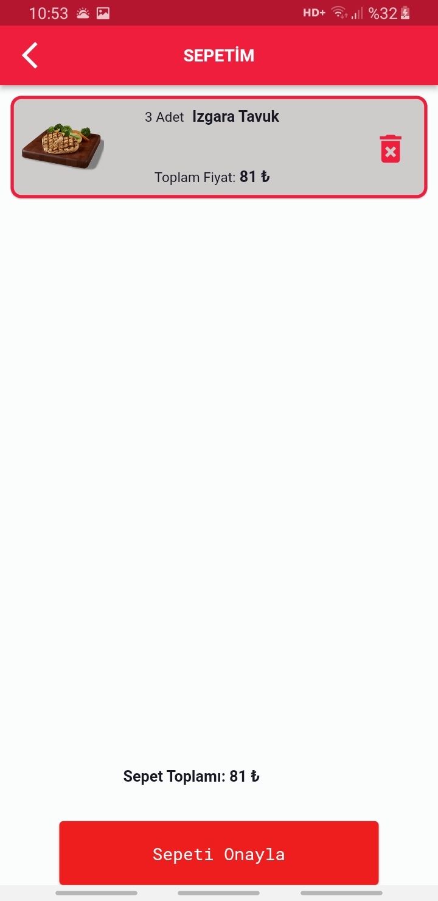
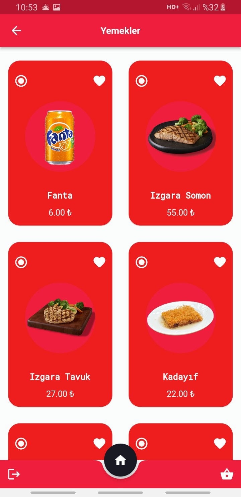
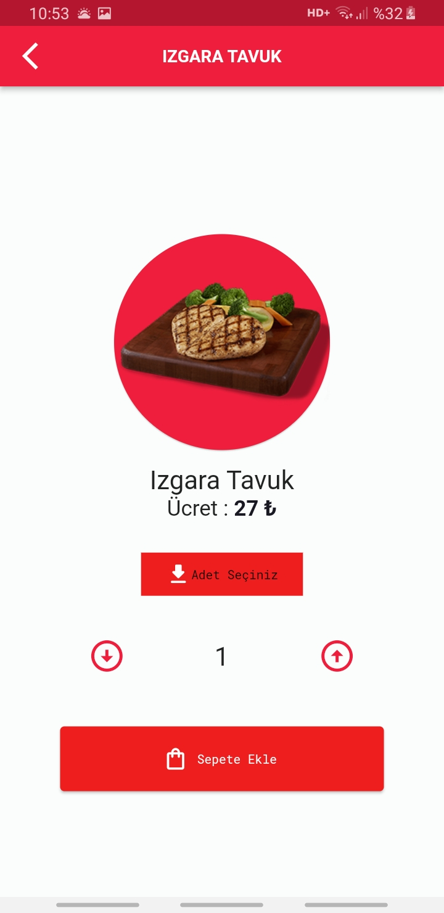
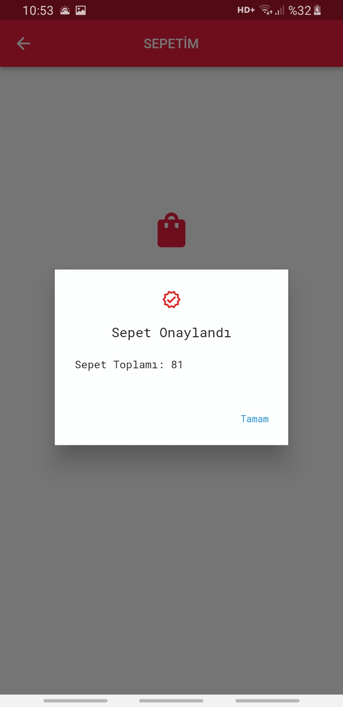

# Flutter FooDelivery Application

This is the graduation project from Techcareer.net's Flutter Bootcamp, and it's an application designed for ordering food.

## Libraries and Technologies Used

- Widgets
- Animation
- Custom Navigation Bar
- Bloc Pattern
- Listview.Builder
- Firebase Authentication
- API Webservice (DIO)

## Features Included in the Application

- Splash screen
- Registration and login screen
- Listing of meals fetched from the API
- Displaying dish details on the detail page
- Adding meals to the cart by selecting the quantity
- Removing items from the cart
- Order confirmation

## Screenshots

<table>
  <tr>
    <td>Splash Screen</td>
    <td>Registration Screen</td>
    <td>Login Screen</td>
    <td>Foods Screen</td>
  </tr>
  <tr>
    <td></td>
    <td></td>
    <td></td>
    <td></td>
  </tr>
</table>

<table>
  <tr>
    <td>Foods Screen</td>
    <td>Cart Screen</td>
    <td>Order Confirmation</td>
  </tr>
  <tr>
    <td></td>
    <td></td>
    <td></td>
  </tr>
</table>

## Tutorial Video

You can watch the [tutorial video here](https://github.com/wazzapsenk/Flutter-FoodDelivery/blob/master/Screenshots/fooDelivery.mp4).

## Getting Started

For help getting started with Flutter development, you can refer to the [online documentation](https://docs.flutter.dev/), which provides tutorials, samples, guidance on mobile development, and a full API reference.
